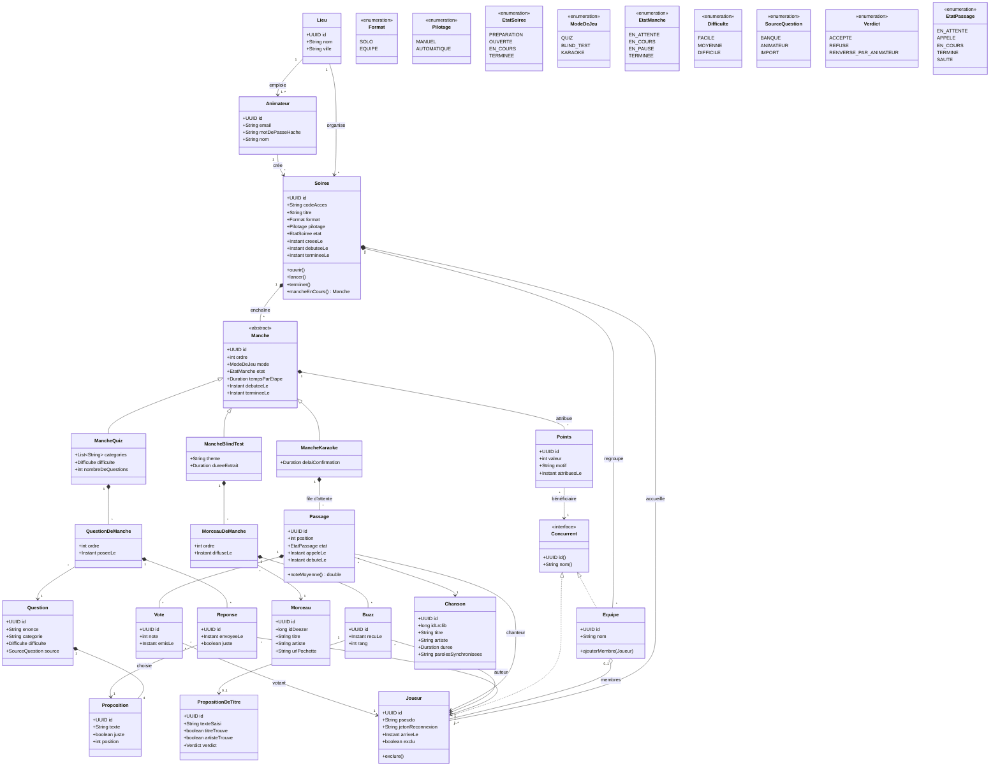
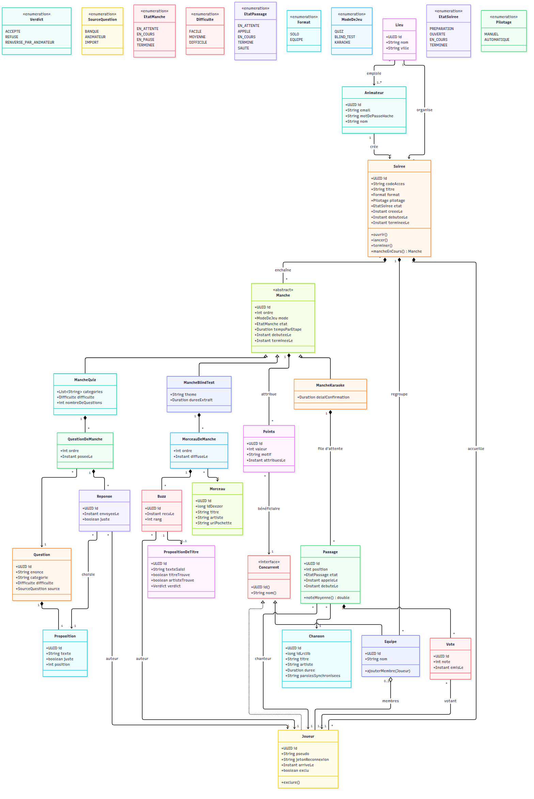
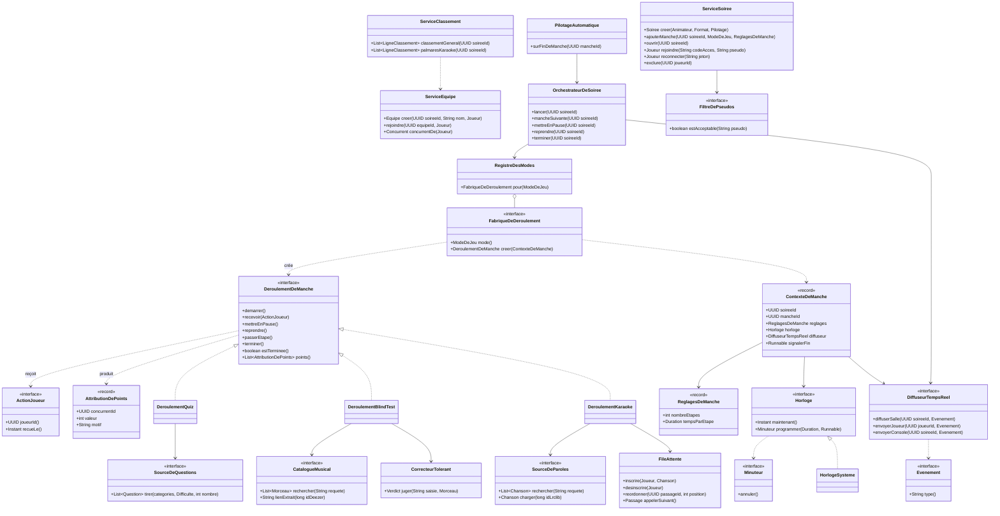
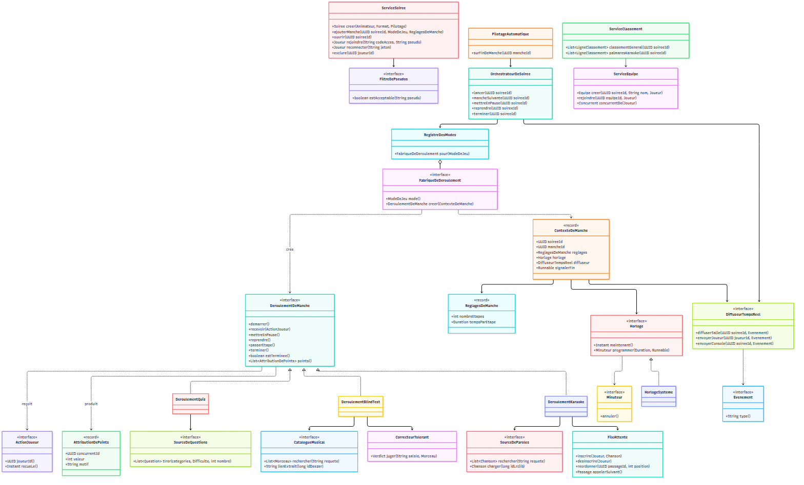

# Diagrammes de classes

Source : PRD (issue #2). Les noms de classes sont ceux du code Java, sans accents ; les concepts sont définis dans `CONTEXT.md`. Les images PNG sont régénérées à partir des blocs Mermaid ci-dessous.

## Domaine

Les entités persistées.

## Services du socle et des modes

Le contrat de Manche (package `manche`) : chaque Mode de jeu fournit une `FabriqueDeDeroulement`, qui crée un `DeroulementDeManche` par Manche. Les ports vers l'extérieur sont en bas.

